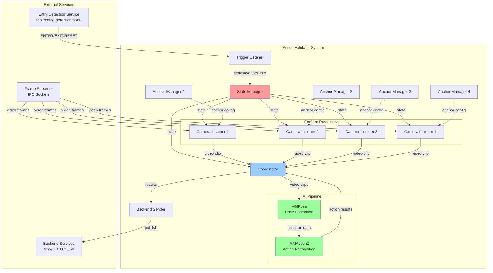
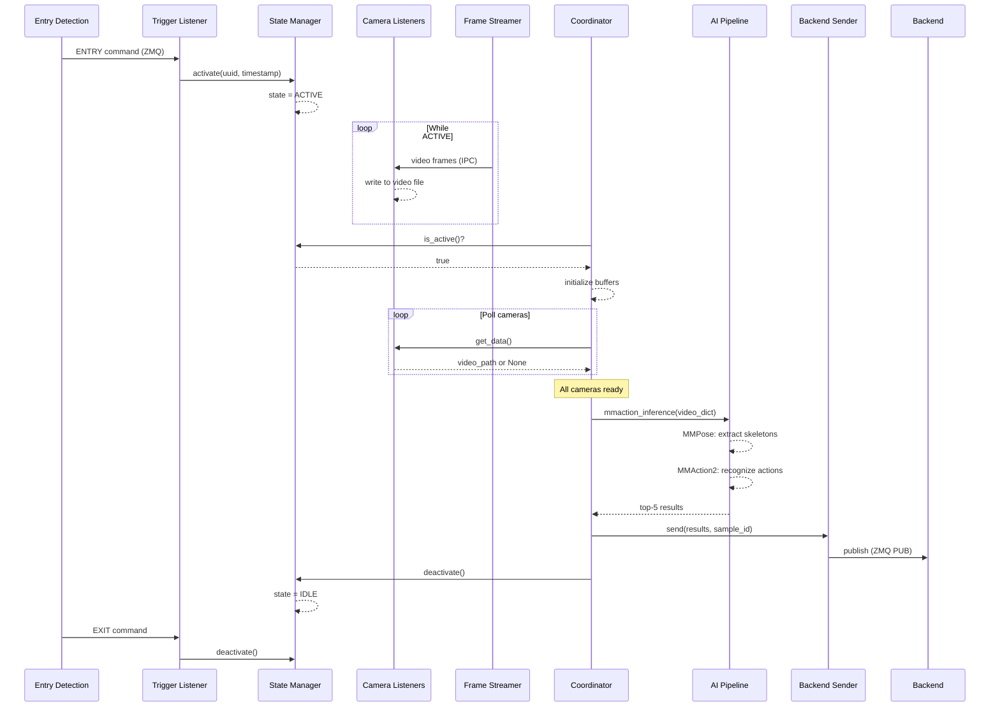
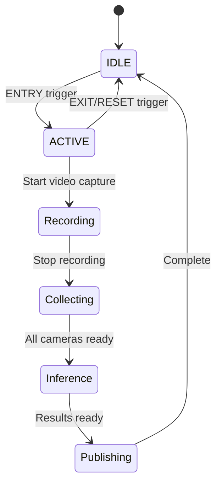
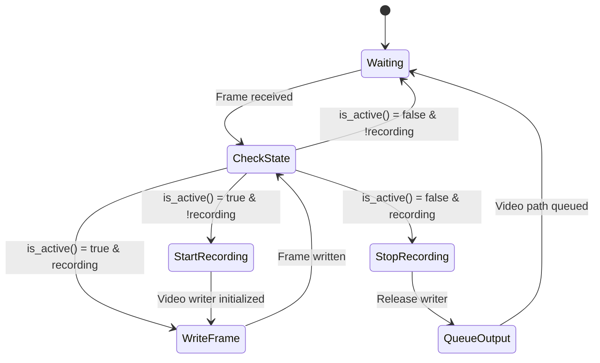
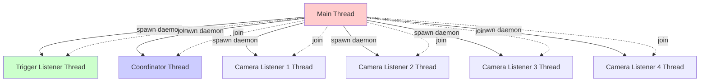

# Action Validator - Comprehensive Architecture Guide

## Table of Contents
1. [Architecture Overview](#architecture-overview)
2. [System Components](#system-components)
3. [Data Flow](#data-flow)
4. [Component Details](#component-details)
5. [Configuration](#configuration)
6. [Setup & Installation](#setup--installation)
7. [Usage](#usage)
8. [API Reference](#api-reference)

---

## Architecture Overview

The **Action Validator** is a multi-camera action recognition system built for real-time human action validation. It uses a **state-driven, event-triggered architecture** that coordinates multiple camera streams to capture synchronized video clips, perform skeleton-based action recognition using MMAction2 and MMPose, and publish results to downstream services.

### High-Level Architecture



### Architecture Principles

1. **Event-Driven**: System activates on external trigger (ENTRY command) and deactivates on exit/reset
2. **State-Based Coordination**: Global state manager synchronizes all components
3. **Multi-Camera Synchronization**: Coordinator waits for clips from all cameras before inference
4. **Asynchronous Processing**: Each camera listener runs in separate thread
5. **ZeroMQ Communication**: Pub/Sub pattern for inter-service messaging
6. **GPU Acceleration**: Leverages CUDA for MMPose and MMAction2 inference

---

## System Components

### 1. Main Entry Point (`main.py`)

**Purpose**: Application initialization and orchestration

**Responsibilities**:
- Load configuration from `config.yml`
- Initialize managers (State, Anchor)
- Start camera listeners for each configured camera
- Launch coordinator and trigger listener threads
- Handle graceful shutdown

### 2. Coordinator (`coordinator.py`)

**Purpose**: Central orchestration hub that manages the action recognition workflow

**States**:
- `IDLE`: Waiting for activation trigger
- `ACTIVE`: Collecting video clips from cameras

**Workflow**:
1. Monitor global state for activation
2. When ACTIVE, initialize buffers for all cameras
3. Collect video clips from each camera listener
4. When all clips ready, trigger inference pipeline
5. Send results to backend
6. Return to IDLE state

### 3. State Manager (`managers/state_manager.py`)

**Purpose**: Thread-safe global state tracking

**States**:
- `IDLE`: System is inactive
- `ACTIVE`: System is recording and ready for inference

**Features**:
- Thread-safe state transitions
- UUID and timestamp tracking for each activation
- Shared across all components

### 4. Anchor Manager (`managers/anchor_manager.py`)

**Purpose**: Manage spatial zones (anchors) for each camera

**Functionality**:
- Define regions of interest (ROI) in camera frames
- Track which anchors have been triggered
- Thread-safe operations
- Reset capabilities

### 5. Trigger Listener (`listener/trigger_listener.py`)

**Purpose**: Listen for external activation commands via ZeroMQ

**Message Format**:
```json
{
  "msg_type": "command",
  "command": "ENTRY|EXIT|RESET",
  "msg_id": "uuid-string",
  "timestamp": "timestamp-value"
}
```

**Commands**:
- `ENTRY`: Activate system, start recording
- `EXIT`/`RESET`: Deactivate system, stop recording

### 6. Camera Listener (`listener/camera_listener.py`)

**Purpose**: Receive frames from camera streams and record video clips

**Features**:
- Connects to Frame Streamer via IPC socket
- Decodes raw RGB frames
- Records video when system is ACTIVE
- Supports two modes:
  - `video`: MP4 video file
  - `frames`: Directory of JPEG frames
- Thread-safe output queue
- Configurable FPS (default: 20)

**Frame Format** (ZeroMQ multipart message):
1. Camera ID (bytes)
2. Timestamp (nanoseconds, bytes)
3. Width (UTF-8 string)
4. Height (UTF-8 string)
5. Raw RGB frame data (bytes)

### 7. Action Recognition Inference (`actionrecognition_inference/inference.py`)

**Purpose**: Run skeleton-based action recognition using MMPose + MMAction2

**Pipeline**:
1. **Pose Estimation** (MMPose):
   - Extract 2D keypoints (17 joints, COCO format)
   - Process video frame-by-frame in batches (32 frames)
   - Support multi-person detection (max 5 people)
   - Apply BottomUp pose estimation

2. **Pose Sequence Padding**:
   - Normalize to fixed dimensions: `(max_person=5, num_frames, num_joints=17, 2)`
   - Sort persons by visibility score

3. **Action Recognition** (MMAction2):
   - Skeleton-based temporal model
   - Multi-camera score aggregation (average)
   - Top-5 action predictions

**Output Format**:
```python
[
  ("action_label_1", 0.95),
  ("action_label_2", 0.82),
  ...
]
```

### 8. Backend Sender (`message/backend_sender.py`)

**Purpose**: Publish inference results to backend services

**Protocol**: ZeroMQ PUB socket

**Message Format**:
```json
{
  "service": "action_validator",
  "sample_id": "uuid_timestamp",
  "timestamp": "2025-12-05T13:28:45",
  "action_results": [
    ["sitting", 0.95],
    ["standing", 0.82]
  ]
}
```

---

## Data Flow

### Complete Workflow Diagram



### State Transition Diagram



### Camera Listener State Machine



---

## Component Details

### Configuration Structure (`config.yml`)

```yaml
cameras:
  camera1:
    anchors:
      - id: "cam1_zone1"
        name: "Entrance Left"
        box: [191, 229, 412, 626]  # [x1, y1, x2, y2]
  camera2:
    anchors:
      - id: "cam2_zone1"
        name: "Entrance Left"
        box: [117, 247, 381, 637]
  # ... more cameras

camera_sockets:
  camera1: camera1_socket
  camera2: camera2_socket
  # ... more sockets
```

**Configuration Parameters**:

| Parameter | Type | Description |
|-----------|------|-------------|
| `cameras.<camera_id>.anchors` | List | Spatial zones (ROI) per camera |
| `anchors[].id` | String | Unique anchor identifier |
| `anchors[].name` | String | Human-readable anchor name |
| `anchors[].box` | [int, int, int, int] | Bounding box coordinates [x1, y1, x2, y2] |
| `camera_sockets.<camera_id>` | String | IPC socket name for camera stream |

### Threading Model



**Thread Safety**:
- **State Manager**: Uses `threading.Lock()` for state transitions
- **Anchor Manager**: Uses `threading.Lock()` for anchor operations
- **Camera Listeners**: Use `queue.Queue(maxsize=5)` for thread-safe output
- **Coordinator**: Event-driven polling (no locks needed)

### Memory Management

**Video Storage**:
- Videos saved to: `/shared/data/{sample_id}/action_validator/`
- Naming convention: `clip_{camera_id}_{timestamp}.mp4`
- Codec: MP4V (OpenCV default)
- Optional deletion after inference via `delete_videos` flag

**GPU Memory**:
- MMPose model loaded once at startup
- MMAction2 model loaded once at startup
- Batch processing (32 frames) to optimize GPU utilization
- `torch.no_grad()` context to disable gradient computation

---

## Configuration

### Environment Variables

| Variable | Default | Description |
|----------|---------|-------------|
| `TZ` | `Asia/Tehran` | Timezone for timestamps |
| `NVIDIA_VISIBLE_DEVICES` | `all` | GPU device visibility |
| `NVIDIA_DRIVER_CAPABILITIES` | `compute,utility` | CUDA capabilities |
| `YOLO_CONFIG_DIR` | `/app/models/yolo` | YOLO model config directory |

### Camera Listener Configuration

```python
CameraListener(
    iou_threshold=0.4,          # IoU threshold for anchor matching
    state_manager=state_manager, # Global state manager instance
    anchor_manager=anchor_mgr,   # Per-camera anchor manager
    bind_addr="ipc:///tmp/socket_name",  # ZMQ IPC socket
    fps=20,                      # Recording FPS
    mode="video",                # "video" or "frames"
    timeout_ms=5000              # ZMQ receive timeout
)
```

### Coordinator Configuration

```python
Coordinator(
    camera_listeners=[...],      # List of CameraListener threads
    backend_sender=backend_sender,  # BackendSender instance
    state_manager=state_manager, # Global state manager
    poll_interval=0.05           # Polling frequency (50ms)
)
```

---

## Setup & Installation

### Prerequisites

- Docker with NVIDIA GPU support
- CUDA-compatible GPU
- Base image: `mmlab:latest` (contains MMAction2, MMPose, MMEngine, MMDetection)

### Docker Build

```bash
# Build the Docker image
docker build -t action_validator:1.0.0 .
```

### Docker Compose Deployment

```yaml
services:
  action_validator:
    image: action_validator:1.0.0
    container_name: action_validator
    command: ["python", "main.py"]
    restart: always
    deploy:
      resources:
        reservations:
          devices:
            - driver: nvidia
              count: all
              capabilities: [gpu]
    volumes:
      - zmq_socket_ipc:/tmp:ro        # IPC sockets (read-only)
      - shared_data:/shared/data      # Shared storage
    networks:
      - ai_vision

volumes:
  zmq_socket_ipc:
    external: true
  shared_data:
    external: true

networks:
  ai_vision:
    external: true
```

### Running the Service

```bash
# Start with Docker Compose
docker-compose up -d

# View logs
docker logs -f action_validator

# Stop service
docker-compose down
```

---

## Usage

### Triggering Action Recognition

**1. Send ENTRY command** (via ZeroMQ to entry_detection service):
```python
import zmq
import json

context = zmq.Context()
socket = context.socket(zmq.PUB)
socket.connect("tcp://entry_detection:5560")

message = {
    "msg_type": "command",
    "command": "ENTRY",
    "msg_id": "550e8400-e29b-41d4-a716-446655440000",
    "timestamp": "1701780525"
}

socket.send_multipart([
    b"detection.command",
    json.dumps(message).encode('utf-8')
])
```

**2. System Response**:
- State Manager activates
- Camera Listeners start recording
- Coordinator initializes buffers

**3. Send EXIT/RESET command**:
```python
message = {
    "msg_type": "command",
    "command": "EXIT",
    "msg_id": "",
    "timestamp": ""
}
# Send same way as ENTRY
```

**4. Receive Results** (subscribe to action_validator topic):
```python
context = zmq.Context()
socket = context.socket(zmq.SUB)
socket.connect("tcp://action_validator:5556")
socket.setsockopt_string(zmq.SUBSCRIBE, "action_validator")

while True:
    topic, message = socket.recv_multipart()
    data = json.loads(message.decode('utf-8'))
    print(f"Results: {data['action_results']}")
```

### Manual Testing

```python
# In main.py, you can manually trigger:
state_manager.activate(uuid="test-uuid", timestamp="123456789")

# Wait for video clips to be recorded...

# System will automatically run inference and publish results
```

---

## API Reference

### State Manager API

```python
class GlobalStateManager:
    def activate(uuid: str, timestamp: str) -> None:
        """Activate system and set sample ID"""
    
    def deactivate() -> None:
        """Deactivate system"""
    
    def is_active() -> bool:
        """Check if system is active"""
    
    def get_id() -> str:
        """Get current sample ID (uuid_timestamp)"""
```

### Anchor Manager API

```python
class AnchorManager:
    def get_all_anchors() -> List[dict]:
        """Get all anchors with current state"""
    
    def set_triggered(anchor_id: str) -> None:
        """Mark anchor as triggered"""
    
    def is_triggered(anchor_id: str) -> bool:
        """Check if anchor is triggered"""
    
    def reset_all() -> None:
        """Reset all anchors to untriggered"""
```

### Camera Listener API

```python
class CameraListener(threading.Thread):
    def get_data() -> Optional[str]:
        """Get recorded video path (non-blocking)"""
    
    def stop() -> None:
        """Signal thread to stop"""
```

### Coordinator API

```python
class Coordinator(threading.Thread):
    def stop() -> None:
        """Signal thread to stop gracefully"""
```

### Backend Sender API

```python
class BackendSender:
    def send(results: List[Tuple[str, float]], sample_id: str) -> None:
        """Publish results to backend"""
    
    def close() -> None:
        """Close ZeroMQ socket"""
```

### Inference API

```python
def mmaction_inference(
    video_dict: Dict[str, str],
    delete_videos: bool = False
) -> List[Tuple[str, float]]:
    """
    Run multi-camera action recognition
    
    Args:
        video_dict: {camera_id: video_path}
        delete_videos: Delete videos after inference
    
    Returns:
        Top-5 actions: [(label, score), ...]
    """
```

---

## Performance Considerations

### Bottlenecks

1. **Pose Estimation**: Most compute-intensive (GPU-bound)
   - **Optimization**: Batch processing (32 frames)
   - **Hardware**: RTX 3090 or better recommended

2. **Video Encoding**: CPU-bound (OpenCV VideoWriter)
   - **Optimization**: Use hardware encoders (H.264)
   - **Alternative**: Switch to `mode="frames"` for faster I/O

3. **ZeroMQ IPC**: Low latency, high throughput
   - **Optimization**: Already optimal for local communication

### Scalability

- **Camera Count**: Tested with 4 cameras, can scale to 8-16 with sufficient GPU memory
- **Frame Rate**: 20 FPS is optimal balance (quality vs. processing time)
- **Clip Duration**: Controlled by ENTRY→EXIT duration (typically 2-5 seconds)

### Resource Usage

| Resource | Idle | Active (4 cameras) |
|----------|------|-------------------|
| CPU | <5% | 30-50% |
| GPU Memory | 2 GB | 6-8 GB |
| RAM | 1 GB | 3-4 GB |
| Disk I/O | Minimal | 80 MB/s (recording) |

---

## Troubleshooting

### Common Issues

**1. No video recorded**
- Check State Manager is activated: `state_manager.is_active()`
- Verify Frame Streamer is publishing frames
- Inspect IPC socket paths match configuration

**2. Inference fails**
- Check GPU availability: `torch.cuda.is_available()`
- Verify model files exist: `./models/pose/`, `./models/mmaction/`
- Check video file integrity (not corrupted)

**3. Results not published**
- Verify Backend Sender socket: `tcp://0.0.0.0:5556`
- Check subscribers are connected before publishing
- Increase `time.sleep(0.5)` in BackendSender initialization

### Logging

**Log Levels**:
```python
logging.basicConfig(
    level=logging.INFO,  # Change to DEBUG for verbose output
    format="%(asctime)s | %(levelname)s | %(name)s | %(message)s"
)
```

**Log Categories**:
- `main`: Application lifecycle
- `Coordinator`: State transitions + inference triggers
- `CameraListener`: Frame reception + recording
- `trigger listener`: Command reception
- `State Manager`: State changes
- `mmaction_inference`: AI pipeline
- `BackendSender`: Result publishing

---

## Action Labels

Actions are defined in `action.json`:

```json
{
  "A1": "Sitting",
  "A2": "Standing",
  "A3": "Walking",
  ...
}
```

Edit this file to customize action labels for your domain.

---

## Future Enhancements

### Planned Features

1. **Real-time Inference**: Stream-based action recognition (no clip recording)
2. **Multi-Person Tracking**: Track individual person IDs across cameras
3. **Anchor-based Triggering**: Start recording when person enters specific zone
4. **Model Hot-swapping**: Update models without service restart
5. **Metrics Dashboard**: Prometheus + Grafana integration
6. **Fallback Mechanisms**: Handle missing camera feeds gracefully

### Optimization Opportunities

1. **TensorRT Optimization**: Convert models to TensorRT for 2-3x speedup
2. **Hardware Video Encoding**: Use NVENC for GPU-accelerated encoding
3. **Distributed Inference**: Split cameras across multiple GPU nodes
4. **Adaptive FPS**: Dynamically adjust recording FPS based on motion

---

## License & Credits

### Dependencies

- **MMAction2**: Action recognition framework
- **MMPose**: Pose estimation library
- **MMEngine**: Training framework
- **OpenCV**: Video processing
- **ZeroMQ**: Inter-process communication
- **PyTorch**: Deep learning backend

### Acknowledgments

This system is built on the excellent work of the OpenMMLab team and the computer vision research community.

---

## Contact & Support

For issues, questions, or contributions, please refer to the project repository or contact the development team.

---

**Document Version**: 1.0  
**Last Updated**: 2025-12-05  
**Author**: Architecture Documentation Team
